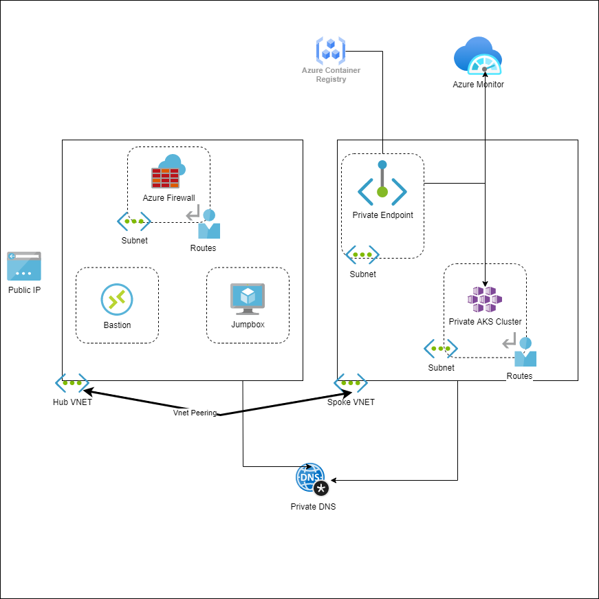

# bicep-aks
Playing with Bicep. 

It provides an overview of modules and resources in Bicep.

The overall architecture

## Setup
The bicep modules will provision the following Azure Resources under subscription scope.

* A Resource Group with Baseline variable
* Hub VNET with required subnets
    1. Azure Firewall Subnet
    2. Azure Bastion Subnet
    3. A jumpbox subnet
* Spoke VNET with AKS cluster subnet and additional subnet for other services like Azure Container Registry etc.
* Azure Firewall and required routes
* Azure Bastion resource and a jumpbox VM without public IP for securing traffic
* Azure Container Registry for storing images.
* A Private Endpoint for ACR
* Private DNS Zone
* AAD Enabled, Managed Private AKS Cluster with monitoring Addon and Azure Policy enabled
    1. Private AK Cluster need the UDR routes enabled via Firewall.

Foundation for this, is built upon cloning [ssarwa](https://github.com/ssarwa/Bicep)
